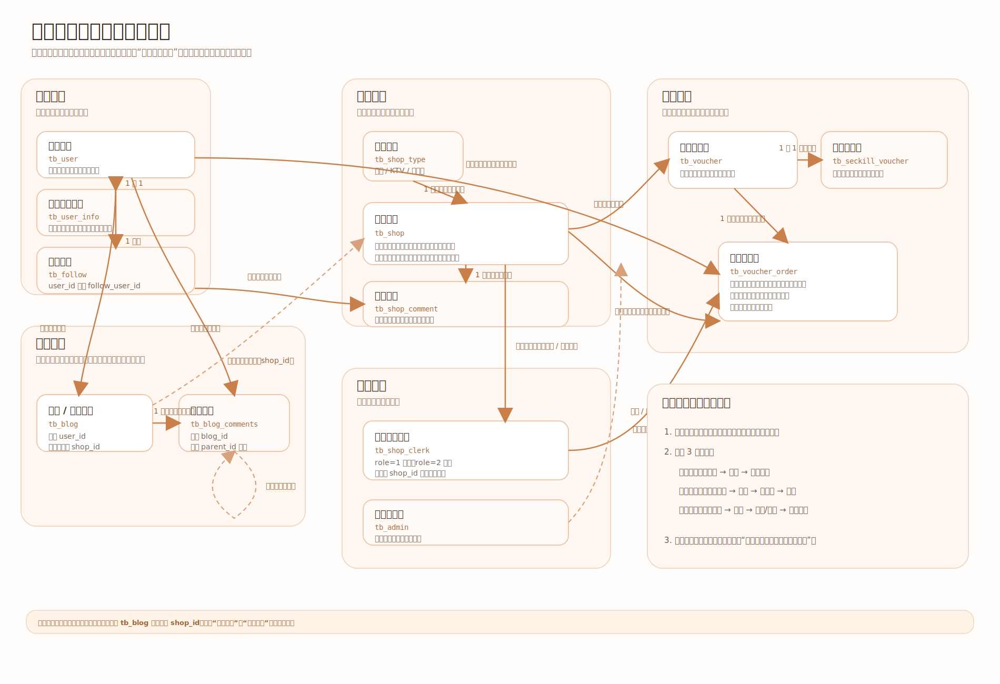
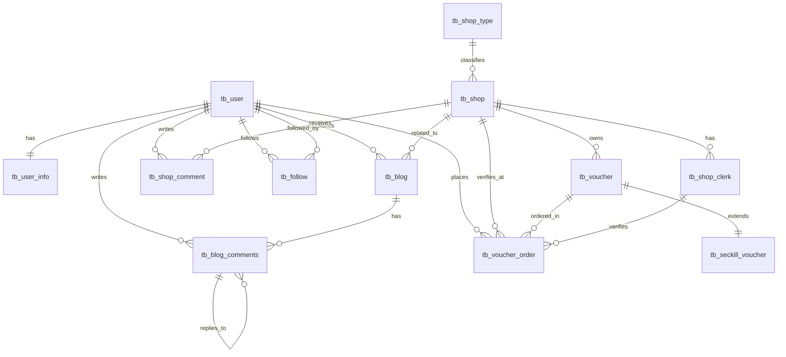

# 城味项目后端数据表关系梳理

这份文档只做一件事：把当前项目后端的核心数据表关系讲清楚。

## 可视化关系图

先看这张中文 SVG 关系图，再往下看文字说明会轻松很多：



建议你的阅读顺序是：

1. 先看“整体分层”
2. 再看“总关系图”
3. 最后看“3 条主业务链”

看完这份文档后，再去看接口和源码会顺很多。

## 1. 整体分层

当前项目的核心表可以分成 5 组：

- 用户模块
  - `tb_user`
  - `tb_user_info`
  - `tb_follow`
  - `tb_sign`
- 内容模块
  - `tb_blog`
  - `tb_blog_comments`
- 店铺模块
  - `tb_shop`
  - `tb_shop_type`
  - `tb_shop_comment`
- 交易模块
  - `tb_voucher`
  - `tb_seckill_voucher`
  - `tb_voucher_order`
- 权限模块
  - `tb_shop_clerk`
  - `tb_admin`

---

## 2. 核心表作用

### 2.1 用户模块

#### `tb_user`

用户主表，保存登录主体信息。

核心字段：

- `id`
- `phone`
- `password`
- `nick_name`
- `icon`

#### `tb_user_info`

用户扩展信息表，补充资料页展示内容。

核心字段：

- `user_id`
- `city`
- `introduce`
- `gender`
- `birthday`
- `fans`
- `followee`

关系：

- `tb_user_info.user_id -> tb_user.id`
- 一对一

#### `tb_follow`

用户关注关系表。

核心字段：

- `user_id`
- `follow_user_id`

关系：

- `tb_follow.user_id -> tb_user.id`
- `tb_follow.follow_user_id -> tb_user.id`

这是一张“用户和用户的中间关系表”，本质上实现的是用户之间的多对多关注关系。

#### `tb_sign`

用户签到相关数据。

逻辑归属：

- 属于用户模块
- 与 `tb_user` 关联

---

### 2.2 内容模块

#### `tb_blog`

用户发布的博客/探店笔记。

核心字段：

- `id`
- `user_id`
- `shop_id`
- `title`
- `images`
- `content`
- `liked`
- `comments`

关系：

- `tb_blog.user_id -> tb_user.id`
- `tb_blog.shop_id -> tb_shop.id`

也就是说：

- 一篇博客由一个用户发布
- 一篇博客可以关联一个店铺

#### `tb_blog_comments`

博客评论表，支持回复。

核心字段：

- `id`
- `user_id`
- `blog_id`
- `parent_id`
- `answer_id`
- `content`

关系：

- `tb_blog_comments.user_id -> tb_user.id`
- `tb_blog_comments.blog_id -> tb_blog.id`
- `tb_blog_comments.parent_id -> tb_blog_comments.id`
- `tb_blog_comments.answer_id -> tb_user.id`

这意味着它不仅支持普通评论，还支持“回复某条评论”和“回复某个人”。

---

### 2.3 店铺模块

#### `tb_shop_type`

店铺分类表。

核心字段：

- `id`
- `name`
- `icon`
- `sort`

#### `tb_shop`

店铺主表，是全项目最核心的业务表之一。

核心字段：

- `id`
- `name`
- `type_id`
- `images`
- `area`
- `address`
- `x`
- `y`
- `avg_price`
- `sold`
- `comments`
- `score`
- `open_hours`

关系：

- `tb_shop.type_id -> tb_shop_type.id`

也就是说，一个店铺属于一个分类。

#### `tb_shop_comment`

用户对店铺的评论。

核心字段：

- `id`
- `shop_id`
- `user_id`
- `content`
- `score`
- `images`

关系：

- `tb_shop_comment.shop_id -> tb_shop.id`
- `tb_shop_comment.user_id -> tb_user.id`

---

### 2.4 交易模块

#### `tb_voucher`

优惠券主表。

核心字段：

- `id`
- `shop_id`
- `title`
- `sub_title`
- `rules`
- `pay_value`
- `actual_value`
- `type`
- `status`

关系：

- `tb_voucher.shop_id -> tb_shop.id`

一个店铺可以配置多张优惠券。

#### `tb_seckill_voucher`

秒杀券扩展表。

核心字段：

- `voucher_id`
- `stock`
- `begin_time`
- `end_time`

关系：

- `tb_seckill_voucher.voucher_id -> tb_voucher.id`
- 一对一

也就是说：

- `tb_voucher` 是普通券主表
- `tb_seckill_voucher` 只负责补充秒杀相关信息

#### `tb_voucher_order`

优惠券订单表。

核心字段：

- `id`
- `user_id`
- `voucher_id`
- `verify_code`
- `status`
- `pay_time`
- `use_time`
- `verify_clerk_id`
- `verify_shop_id`

关系：

- `tb_voucher_order.user_id -> tb_user.id`
- `tb_voucher_order.voucher_id -> tb_voucher.id`
- `tb_voucher_order.verify_clerk_id -> tb_shop_clerk.id`
- `tb_voucher_order.verify_shop_id -> tb_shop.id`

这张表连接了：

- 用户
- 店铺券
- 店员核销
- 门店履约

它是整个交易链路的核心落库表。

---

### 2.5 权限模块

#### `tb_shop_clerk`

店员/店长账号表。

核心字段：

- `id`
- `shop_id`
- `username`
- `password`
- `name`
- `role`
- `status`

关系：

- `tb_shop_clerk.shop_id -> tb_shop.id`

角色含义：

- `role = 1`：店长
- `role = 2`：店员

这张表承担的是“门店内部权限体系”。

#### `tb_admin`

平台管理员账号表。

核心字段：

- `id`
- `username`
- `password`
- `name`
- `status`

说明：

- 管理员不直接隶属于某个店铺
- 它是平台级角色

---

## 3. 总关系图

下面这张图建议你反复看，它是全项目最核心的一张表关系图。

如果你要粘到 Mermaid 在线编辑器，必须从 `erDiagram` 这一行一起复制，不能只复制下面的关系行。



可直接粘贴版：

```text
erDiagram
    tb_user ||--|| tb_user_info : has
    tb_user ||--o{ tb_blog : publishes
    tb_user ||--o{ tb_blog_comments : writes
    tb_user ||--o{ tb_shop_comment : writes
    tb_user ||--o{ tb_voucher_order : places
    tb_user ||--o{ tb_follow : follows
    tb_user ||--o{ tb_follow : followed_by

    tb_shop_type ||--o{ tb_shop : classifies
    tb_shop ||--o{ tb_blog : related_to
    tb_shop ||--o{ tb_shop_comment : receives
    tb_shop ||--o{ tb_voucher : owns
    tb_shop ||--o{ tb_shop_clerk : has
    tb_shop ||--o{ tb_voucher_order : verifies_at

    tb_blog ||--o{ tb_blog_comments : has
    tb_blog_comments ||--o{ tb_blog_comments : replies_to

    tb_voucher ||--|| tb_seckill_voucher : extends
    tb_voucher ||--o{ tb_voucher_order : ordered_in

    tb_shop_clerk ||--o{ tb_voucher_order : verifies
```

---

## 4. 分模块理解关系

### 4.1 用户内容链

这条链最适合入门。

```text
tb_user
  -> tb_blog
    -> tb_blog_comments
```

理解方法：

- 用户发布博客
- 博客可以被评论
- 评论还可以继续回复

如果你先学博客模块，建议就围绕这条线看。

---

### 4.2 店铺交易链

这是项目里最关键的一条业务链。

```text
tb_shop_type
  -> tb_shop
    -> tb_voucher
      -> tb_seckill_voucher
      -> tb_voucher_order
```

理解方法：

- 店铺先有分类
- 店铺下面配置优惠券
- 部分优惠券带秒杀属性
- 用户最终下单，落到订单表

如果你后面要看秒杀、支付、核销，这条链一定要先吃透。

---

### 4.3 店铺履约链

这条链连接了店铺、店长/店员、订单核销。

```text
tb_shop
  -> tb_shop_clerk
  -> tb_voucher
    -> tb_voucher_order
      -> verify_clerk_id
      -> verify_shop_id
```

理解方法：

- 店铺下面有店长和店员
- 用户买的是该店铺的券
- 到店核销时，会记录是哪个店员、在哪个门店完成核销

这条线就是店员端、店长端最核心的后端数据支撑。

---

### 4.4 平台管理链

```text
tb_admin
  -> 创建 tb_shop
  -> 创建首个 tb_shop_clerk(role=1)
```

理解方法：

- 管理员属于平台角色
- 管理员负责新建店铺
- 新建店铺时必须创建首个店长
- 店长再去管理本店其他员工

所以：

- `tb_admin` 不直接和订单表关联
- 但它控制了整个平台的“门店创建入口”

---

## 5. 你最应该先记住的 3 条主线

如果你现在觉得表太多，先只记下面这 3 条：

### 主线 1：用户内容主线

```text
tb_user -> tb_blog -> tb_blog_comments
```

### 主线 2：店铺交易主线

```text
tb_shop_type -> tb_shop -> tb_voucher -> tb_voucher_order
```

### 主线 3：门店权限与履约主线

```text
tb_admin -> tb_shop -> tb_shop_clerk -> tb_voucher_order
```

---

## 6. 学源码时怎么对照这份关系图

你后面看源码时，每个接口都问自己 4 个问题：

1. 这个接口在操作哪张主表？
2. 它会不会顺带查关联表？
3. 这个接口属于哪个角色？
4. 这条数据最后会落到哪张表？

例子：

- 用户改昵称
  - 主表：`tb_user`
- 用户发博客
  - 主表：`tb_blog`
  - 关联：`tb_user`
- 店长创建员工
  - 主表：`tb_shop_clerk`
  - 关联：`tb_shop`
- 用户抢券下单
  - 主表：`tb_voucher_order`
  - 关联：`tb_voucher`、`tb_seckill_voucher`、`tb_user`
- 店员核销
  - 主表：`tb_voucher_order`
  - 关联：`tb_shop_clerk`、`tb_shop`

---

## 7. 下一步建议

看完表关系后，最适合继续做的是：

1. 按模块出接口文档
2. 给接口分难度等级
3. 再按接口去反查 Controller / Service / Redis / SQL

建议接口文档顺序：

1. 用户模块接口
2. 店铺模块接口
3. 博客模块接口
4. 订单与秒杀模块接口
5. 店员/店长模块接口
6. 管理端模块接口

这样学习节奏会最稳。
